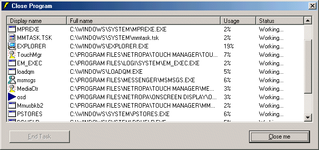



## Ctrl2 \(ctrl\+alt\+del the second\)

### Description

This code will find all running programms(i mean realy all you will see more the ctrl&alt&del) now you say : 'the are here already' yeah but this code have some new things like shortcut key ctrl&+ to open the window it olso have a usage monitor and icon view. please give me a feedback or a vote thx , egbert :P
 
### More Info
 

             |
---                |---
**Submitted On**   |2001-02-21 12:22:58
**By**             |[egbert](https://github.com/Planet-Source-Code/PSCIndex/blob/master/ByAuthor/egbert.md)
**Level**          |Intermediate
**User Rating**    |5.0 (10 globes from 2 users)
**Compatibility**  |VB 5\.0, VB 6\.0
**Category**       |[Windows System Services](https://github.com/Planet-Source-Code/PSCIndex/blob/master/ByCategory/windows-system-services__1-35.md)
**World**          |[Visual Basic](https://github.com/Planet-Source-Code/PSCIndex/blob/master/ByWorld/visual-basic.md)
**Archive File**   |[CODE\_UPLOAD171783172001\.zip](https://github.com/Planet-Source-Code/egbert-ctrl2-ctrl-alt-del-the-second__1-21709/archive/master.zip)

